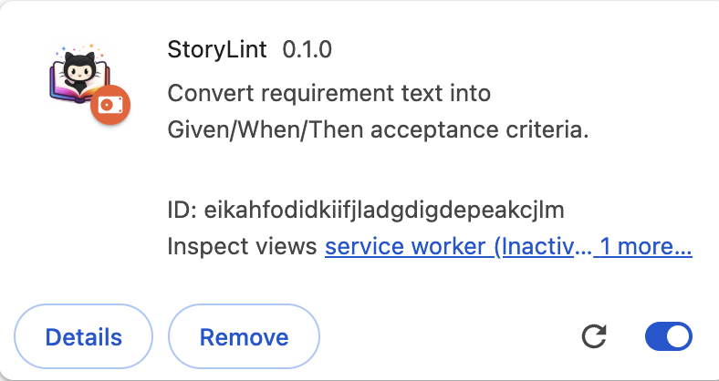
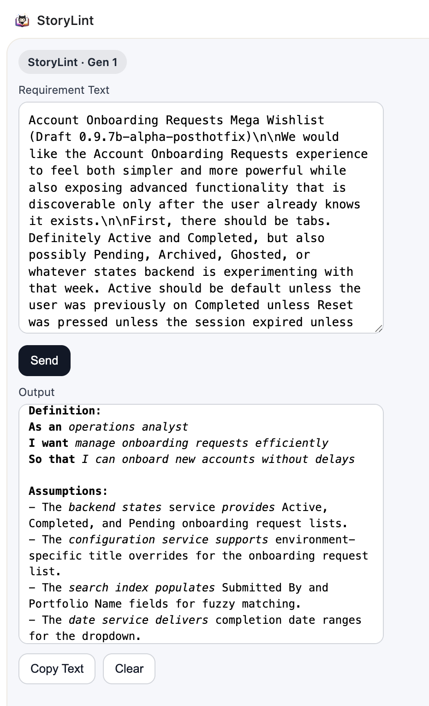

# StoryLint

Linting for product requirements.

StoryLint is a Chrome extension that converts narrative, ambiguous product requirements into deterministic, testable **Given / When / Then** specifications.

Paste messy stories. Get clean acceptance criteria. No fluff. No opinions.

---

## AI/Dev Assistant Start Here

- Read [AGENTS.md](AGENTS.md) first
- Use prompts in [LLM_PROMPTS/README.md](LLM_PROMPTS/README.md)
- Default bootstrap prompt: [LLM_PROMPTS/SESSION_BOOTSTRAP.md](LLM_PROMPTS/SESSION_BOOTSTRAP.md)

---

## Why StoryLint exists

Most agile stories fail for the same reasons:

- Narrative instead of behavior
- Subjective language (“I would expect”)
- Multiple behaviors stuffed into one scenario
- Visual state and logic scattered across steps

StoryLint enforces clarity. One behavior. One outcome. Testable.

---

## What it does

- Normalizes messy input (bullets, notes, OCR-ish text)
- Extracts actors, actions, conditions, and outcomes
- Generates clean **Given / When / Then** scenarios
- Produces output suitable for Jira, Linear, or plain text

---

## Example

<table>
	<tr>
		<td></td>
		<td></td>
	</tr>
</table>

## Input
Account Onboarding Requests Mega Wishlist (Draft 0.9.7b-alpha-posthotfix)\n\nWe would like the Account Onboarding Requests experience to feel both simpler and more powerful while also exposing advanced functionality that is discoverable only after the user already knows it exists.\n\nFirst, there should be tabs. Definitely Active and Completed, but also possibly Pending, Archived, Ghosted, or whatever states backend is experimenting with that week. Active should be default unless the user was previously on Completed unless Reset was pressed unless the session expired unless deep linked unless feature flag X9 is off.\n\nThe title should say \"Onboarding Request List\" except when marketing wants \"Account Onboarding Hub\" or legal needs \"Request Viewing Interface\". These should be configurable per environment.\n\nSearch should be global but also scoped but also fuzzy but also exact. It should search by ID, Portfolio Name, Submitted By, partial Submitted By, full Submitted By, typo versions of Submitted By, and anything that feels adjacent semantically. It should update instantly unless performance is slow, in which case debounce, unless the user expects instant feedback, in which case don’t. Also the hint text should say \"Search by ID, Portfolio Name, or Submitted By\" but only if the field is empty and the user hasn’t previously searched for something else in a different tab.\n\nCompletion Date dropdown should default to Last 7 Days on Completed but also remember whatever the user picked last time unless this is their first visit or unless cookies are disabled or unless backend overrides the default based on region or compliance rules. The dropdown should include Last 30 Days, Custom Range, All Time, and Possibly Future Dates (for testing). Selecting a range should update results immediately but also show a spinner even if results are already loaded because otherwise users don’t feel reassured.\n\nReset should reset everything, except things that users might find annoying to reset, like their preferred tab, but also sometimes it should reset the tab because that’s technically part of the filters. Reset should clear search, date, column order, cached expectations, and emotional baggage.\n\nColumn order should be:\n\nAccount Onboarding ID\nSubmitted By\nShareholder Portfolio Name\nCompletion Date\nAccounts\n\nUnless screen is small, then reorder. Unless user previously dragged columns, then honor that. Unless design refresh v3 is live, then new order. Also columns should be sortable except ones that aren’t except sometimes they should be.\n\nRows should load progressively but appear instantly. Pagination should exist but also infinite scroll. There should be a spinner but only when loading but also when not loading so users know something is happening. Background should be gray while loading but white when loaded but sometimes stay gray if API is slow.\n\nEmpty states should appear when no data exists but not when data exists but is filtered out, unless backend returns empty even though data exists, which should show an empty state but also a warning toast that disappears after 2.3 seconds.\n\nCompleted should only show completed unless backend still processing completion, in which case show them anyway but label them pending-complete. Active might contain completed depending on sync timing.\n\nSearch + filters + reset + tab switching + pagination + sorting should all work together unless they don’t, in which case whichever action happened last wins.\n\nWe also want:\n\n* Export to CSV (later)\n* Remember user preferences (maybe)\n* Keyboard shortcuts (eventually)\n* Dark mode compatibility even though app doesn’t have dark mode\n* Deep links into filtered views\n* URL parameters that override UI state but also get overridden by UI state\n* Accessibility compliance but only after MVP\n* Performance improvements without changing behavior\n* Behavior changes without affecting performance\n\nIf anything conflicts, prioritize business intent.\n\nIf business intent unclear, prioritize UX.\n\nIf UX unclear, prioritize engineering feasibility.\n\nIf engineering unclear, ship anyway

## Output
**Feature:** Account Onboarding Requests Experience Enhancement

**Definition:**
As an operations analyst
I want manage onboarding requests efficiently
So that I can onboard new accounts without delays

**Assumptions:**
- The backend states service provides Active, Completed, and Pending onboarding request lists.
- The configuration service supports environment-specific title overrides for the onboarding request list.
- The search index populates Submitted By and Portfolio Name fields for fuzzy matching.
- The date service delivers completion date ranges for the dropdown.

**Acceptance Criteria**

**Scenario**: Default tab selection honors user history and overrides  
**Given**: the operations analyst opens the Account Onboarding Requests experience  
**When**: the tabs render  
**Then**: the Active tab displays by default  

**Scenario**: Custom tab selection persists across sessions  
**Given**: the operations analyst selects the Completed tab  
**When**: the session ends and restarts  
**Then**: the Completed tab restores as the default  

**Scenario**: Tab defaults respect overrides and conditions  
**Given**: the feature flag X9 is off  
**When**: the Account Onboarding Requests experience initializes  
**Then**: the Active tab renders as the default  

**Scenario**: Configurable title displays based on environment  
**Given**: the operations analyst opens the Account Onboarding Requests experience  
**When**: the title component renders  
**Then**: the title displays "Onboarding Request List"  

**Scenario**: Global search queries multiple fields with scoping  
**Given**: the operations analyst enters a search term  
**When**: the search executes  
**Then**: the results include matching ID, Portfolio Name, and Submitted By values  

**Scenario**: Search hint appears  
**Given**: the search field is empty  
**When**: the Account Onboarding Requests experience renders  
**Then**: the search hint "Search by ID, Portfolio Name, or Submitted By" displays  

**Scenario**: Search debounce prevents rapid queries  
**Given**: the operations analyst enters a search term  
**When**: the debounce interval elapses  
**Then**: the search query executes  

**Scenario**: Completion Date dropdown defaults on Completed tab  
**Given**: the operations analyst is viewing the Completed tab  
**When**: the Completion Date dropdown renders  
**Then**: the Last 7 Days range defaults  

**Scenario**: Completion Date dropdown selection updates results  
**Given**: the operations analyst opens the Completion Date dropdown  
**When**: the operations analyst selects a date range  
**Then**: the onboarding request results refresh with the selected range  

**Scenario**: Reset clears all filters and state  
**Given**: the operations analyst has applied filters and search terms  
**When**: the operations analyst clicks Reset  
**Then**: the tabs, search field, date range, and sorting reset to default state  